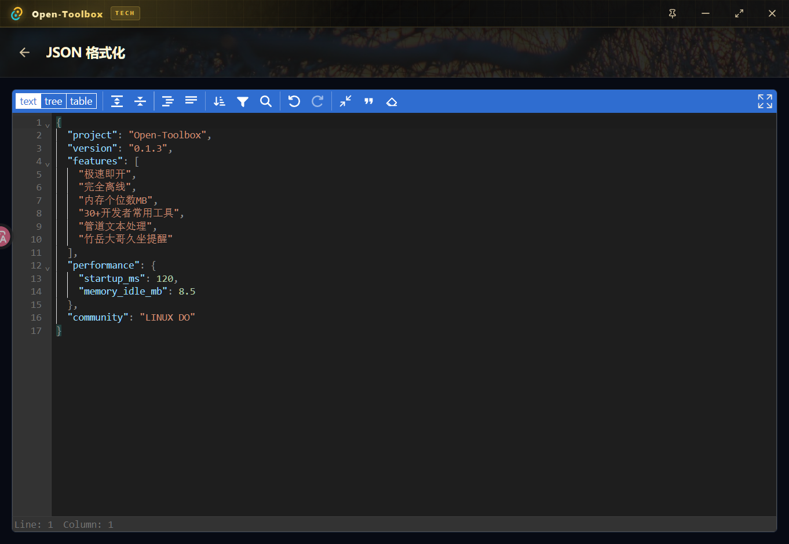
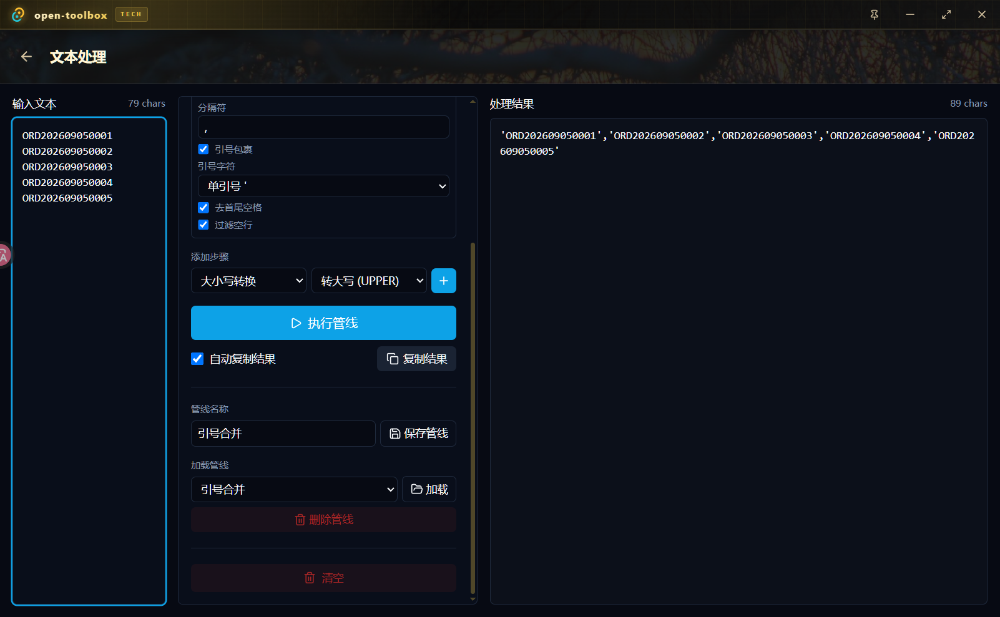
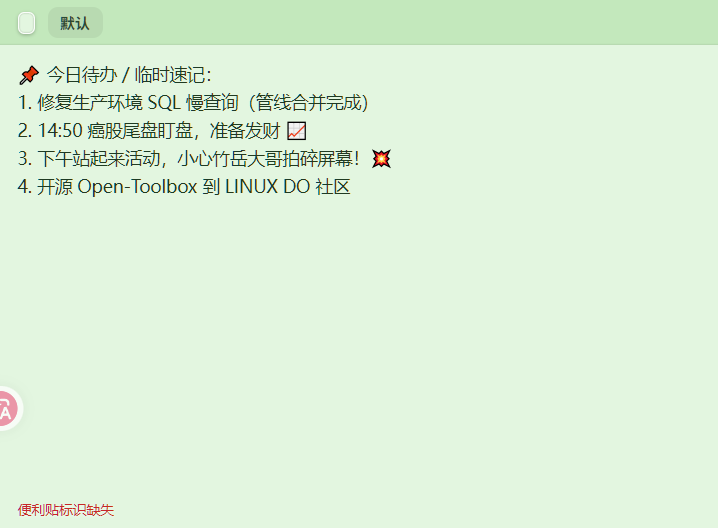

# 「开源自荐」“你说了这么多‘有的’，到底TM是哪个？” —— Open-Toolbox：超轻量离线开发者全能工具箱

本帖使用社区开源推广，符合推广要求。我申明并遵循社区要求的以下内容：

- 我的帖子已经打上 **开源推广** 标签：**是**
- 我的开源项目完整开源，无未开源部分：**是**
- 我的开源项目已链接认可 LINUX DO 社区：**是**
- 我帖子内的项目介绍，AI 生成、润色内容部分已截图发出：**是**
- 以上选择我承诺是永久有效的，接受社区和佬友监督：**是**

---

各位 LINUX DO 的佬友们大家好！

作为一个每天被各种乱七八糟的临时需求、奇怪数据和业务报文折磨得欲仙欲死的苦逼搬砖码农，最近经常在论坛和群里看到大家各种各样的工具痛点吐槽。

今天，我把这段对话原汁原味地端上来：

---

### 🗣️ 一场关于“神仙工具”的灵魂对线

#### 1. 关于数据脱敏与 JSON
- **佬友问**：有没有一款完全离线的 JSON 格式化工具啊？在线网页工具不仅满屏弹窗广告，还要经常往里面粘核心业务报文或生产 Token，老担心数据被偷偷上传、第二天被公司请去喝茶？
- **答**：**有的朋友！**
  **Open-Toolbox** 100% 本地纯离线运行，零遥测、不发哪怕一个网络请求。内置专业代码编辑器，支持树形折叠、一键去斜杠转义、格式校验，更自带双栏 **JSON Diff**，两个接口出入参哪里对不上，红绿高亮一眼看穿！


*(图1：JSON 格式化、压缩校验与 JSON Diff 对比)*

---

#### 2. 关于业务折磨与 SQL 拼接
- **佬友问**：有没有一种工具能救救孩子？业务/运营在飞书或者微信里经常甩过来几百行换行的订单号、工号，领导让我去数据库查数 `SELECT * FROM table WHERE code IN (...)`。难道我每次都要在 VS Code 里写正则、或者在 Excel 里面手动加单引号和逗号搞半天吗？
- **答**：**有的朋友！**
  打开【文本处理】工具，多行数据一键粘贴，直接运行内置的“**引号合并**”执行管线——**一秒钟自动给每一行包上英文单引号 `'`，并用英文逗号 `,` 拼接成一整行**！
  输出直接就是：`'ORD202609050001','ORD202609050002',...`。直接 Ctrl+C 塞进 SQL 的 `IN (...)` 里，省下大把时间去摸鱼！


*(图2：文本处理管线——多行业务编码一秒自动加单引号与逗号合并)*

---

#### 3. 关于开记事本太烦
- **佬友问**：有没有那种经常要临时记两行调试日志、临时密钥或者待办，专门打开 Windows 记事本觉得特别沉重，关掉的时候又弹窗问你“是否保存”，桌面存了一堆 `新建文本文档 (12).txt` 的终结者？
- **答**：**有的朋友！**
  全局快捷键 `Ctrl+Shift+T` 一按，桌面轻量**便利贴**瞬时弹出！支持置顶、透明度调节、变色，窗口失焦或者随手关掉都会在本地自动持久化保存，不占桌面、随记随查，再也不用满桌面找记事本了！


*(图3：桌面便利贴快捷键一按即出，随写随存)*

---

#### 4. 关于久坐伤腰与防猝死
- **佬友问**：写代码上头了一坐就是三四个小时，腰椎颈椎都要废了！但是系统自带的那种微弱通知弹窗我根本注意不到，有没有那种能真正把我从椅子上拉起来的久坐提醒？
- **答**：**有的朋友！**
  到了设定的时间，直接给你弹出一个全屏强视觉冲击的脉冲大红窗！更支持配置自定义名场面视频与音效——**竹岳大哥一巴掌拍碎屏幕**直接糊在脸上，隔着屏幕都能感受到那声怒吼：“**老弟！电脑都要被你干坏了，赶紧站起来活动活动腰椎！**”
  关键是它还带 **Windows 原生闲置检测**：你去接水上厕所超过 5 分钟，回来自动将久坐计时重置，绝对不瞎提醒；还支持配置午休与下班时段免打扰屏蔽！


*(图4：久坐提醒设置，支持闲置检测与自定义名场面视频)*


*(图5：到点弹出的全屏强警示大窗，竹岳大哥催你活动)*

---

#### 5. 关于上班摸鱼盯盘与效率专注
- **佬友问**：有没有给某些一边工作一边炒股的老友们准备的神器？开着行情软件怕被路过的领导抓个现行，不开又怕错过尾盘 14:50 突袭拉升或者跳水，不知道什么时候该发财；顺便平时写代码还能兼职当番茄钟用的？
- **答**：**有的朋友！**
  内置【计时中心】，贴心支持工作日专属闹钟！周一到周五 14:50 准点桌面轻量弹窗提醒：“**癌股尾盘盯盘发财！**”助老友们从容决定抢筹还是跑路；敲代码时一键切换到 25+5 分钟经典番茄钟，沉浸专注冲刺。


*(图6：工作日 14:50 癌股尾盘发财闹钟)*


*(图7：内置标准番茄钟)*

---

#### 6. 关于掏手机看 2FA 与测试账号
- **佬友问**：每次登录 GitHub、GitLab、云平台，都要到处摸手机解锁打开 Google Authenticator 找那 6 位动态验证码，贼麻烦！有没有能直接在电脑上跑的 2FA？测试环境一堆账号密码还老记不住怎么办？
- **答**：**有的朋友！**
  内置 **2FA 动态令牌验证器**，支持 Base32 密钥与 `otpauth://` URI 解析，电脑端每 30 秒实时计算 TOTP 动态码，一键点击复制；还内置本地加密【密码夹】，网站、账号、密码安全保管，再也不用在聊天软件里翻密码了！


*(图8：本地 2FA 动态口令实时计算器)*


*(图9：本地安全加密密码夹)*

---

#### 7. 关于体积与内存占用
- **佬友问**：市面上那些工具箱我也试过不少，但动不动就捆绑一个 Chromium 打包成两三百兆的 Electron 大胖子，后台挂着吃三四百兆内存，电脑开几个 IDE 已经够喘了，有没有真正极速原生、轻如鸿毛的？
- **答**：**有的朋友！**
  坚决拒绝 Electron！采用 **Rust + Tauri 2** 打造，安装包仅约 **12 MB**，开机常驻空闲内存仅 **个位数 MB（~8~15MB）**！`Alt+Space` 毫秒级唤起，比你在 Chrome 里新开一个空白标签页还要省资源！


*(图10：极速轻量，30+ 款高频工具一个窗口搞定)*

---

### 💥 佬友终于忍不住拍桌而起：

> **“停停停！你说了这么多‘有的’，到底 TM 的是哪个工具？！还不赶紧端出来给大家用！😡”**

---

### 🎉 **有的朋友！它就是 —— `Open-Toolbox`！**

满足上面提到的所有任性要求，全开源、全免费、无广告、纯离线！

- 📦 **项目名称**：Open-Toolbox
- 🔗 **GitHub 仓库**：[https://github.com/Planck812/openToolBox](https://github.com/Planck812/openToolBox)
- 🚀 **Windows 预编译包下载**：[GitHub Releases 最新发布](https://github.com/Planck812/openToolBox/releases/latest)
- 📜 **开源协议**：MIT License

---

## 🛠️ 工具全景图（30+ 款开发者武器库）

| 工具类别 | 包含的功能清单 |
| :--- | :--- |
| 📝 **文本处理** | 文本处理管线、文本分割、文本合并、文本去重、文本对比、正则实验室、格式转换 |
| 🔧 **数据格式** | JSON 查看/校验、JSON Diff 对比、时间戳双向转换、Base64 编解码、二维码/条形码、图片查看 |
| ⚙️ **开发必备** | UUID 生成、哈希计算 (MD5/SHA)、JWT 解析、TOTP 2FA 双因素、Curl 执行器、AES 加解密、环境变量设置、**端口占用杀手**、Mermaid 流程图、程序员计算器 |
| 🚀 **系统效率** | 全平台截图（含 UIA 智能控件吸附与滚动长截图）、离线 OCR、桌面便利贴、备忘录、密码夹、计时中心、久坐强力提醒 |

---

## 💻 技术栈与源码调试

- **外壳内核**：Rust + Tauri 2.x（基于系统原生 WebView2，抛弃臃肿 Chromium）
- **前端技术**：Vue 3 (`<script setup>`) + TypeScript + Pinia + TailwindCSS + Vite
- **极速子窗口**：便利贴、久坐弹窗、贴图等各自采用独立精简 HTML 入口，首帧秒开。
- **纯前端模式（免装 Rust 也能摸鱼参与）**：
  仓库内置了完整的浏览器 Mock 机制。**即使电脑没有 Rust 编译环境**，前端佬友直接克隆仓库 `npm install && npm run dev`，浏览器打开 `localhost:1420` 就能直接改页面、做开发、看效果！

```bash
# 源码体验步骤：
git clone https://github.com/Planck812/openToolBox.git
cd openToolBox
npm install

# 纯前端极速开发预览（无需 Rust）
npm run dev

# 桌面端完整开发调试（需 Rust 环境）
npm run tauri dev
```

---

## ❤️ 致谢与欢迎拍砖

真诚、友善、团结、专业，非常感谢 **LINUX DO** 社区为开源开发者提供这样优质的交流环境。

这个项目是利用业余时间搓出来的，虽然我已经日常当主力工具在用了，但难免有考虑不周或 Bug。非常期待各位佬友们下载试用、多提 Issue 拍砖、或者提交 PR 添砖加瓦！

如果你觉得 Open-Toolbox 刚好戳中了你的痛点、能帮你每天少点几次鼠标，欢迎顺手到 GitHub 点个 ⭐️ **Star**，这就是对独立开源开发者最好的鼓励！

👉 **GitHub 地址**：[https://github.com/Planck812/openToolBox](https://github.com/Planck812/openToolBox)
